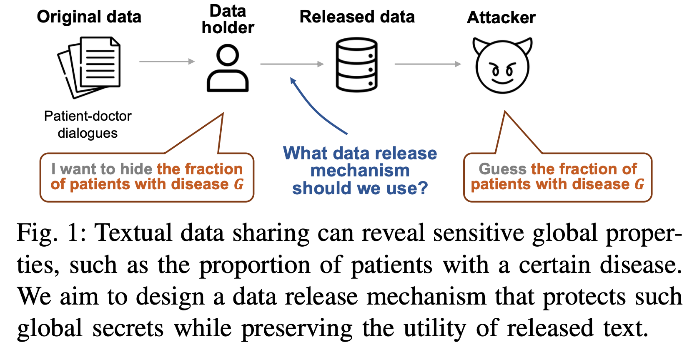

# QuanText: Protecting Dataset-Level Secrets in Textual Data Sharing

Official code for **QuanText** (Randomized Quantization for Text), a
training-free, large-language-model-agnostic data-release mechanism that
protects *dataset-level* secrets — such as the proportion of records
associated with a particular gender, diagnosis, or stance — when sharing
textual datasets, while preserving downstream utility.

<p align="center">
  
</p>

Given the attribute types over which the data holder wants to retain utility
(e.g., topic and sentiment), QuanText:

1. **constructs** a set of candidate release distributions over those attribute
   types (approximating their joint distribution as a product of factors via
   the Chow–Liu algorithm);
2. **randomly selects** a release distribution that is close to the private
   empirical distribution; and
3. **rewrites** each private sample to match the chosen distribution, reusing
   attribute-related snippets extracted from the original text.

QuanText is inspired by the **Statistic Maximal Leakage (SML)** framework,
which bounds leakage about a secret function of a data distribution: under
ideal conditions QuanText satisfies a formal SML guarantee, and on real-world
datasets it achieves a better empirical privacy–utility trade-off than
competing data-generation baselines (Private Evolution, DP fine-tuning).

---

## Repository structure

```
.
├── tweet/        # Tweet Stance dataset  (Target / Stance / Sentiment)
└── PropInfer/    # PropInfer medical dialogues (gender, diagnosis)
```

Each subproject is self-contained and shares the same pipeline design.

```
<project>/
├── chow_liu.py / chow-liu.py   # Step 1: Chow–Liu tree + candidate release distributions
├── quantization.py             # Step 2: randomized quantization -> target attribute arrays
├── generation.py /             # Step 3: snippet extraction -> rewrite -> (judge)
│   tweet_generation.py
├── prompts/                    # SML generation prompts (per attribute domain)
├── evaluation/
│   ├── evaluate.py             # length / kNN precision-recall / FID / attribute-TV
│   └── precision_recall.py
├── attack/
│   ├── labeling_attack.py      # LLM re-labels released text
│   ├── proportion.py           # proportion-inference attack: diff vs. true proportions
│   └── prompts/                # labeling prompts (per attribute domain)
├── PE/                         # Baseline: Private Evolution (DPSDA)
├── DPFT/                       # Baseline: DP-LoRA fine-tuning (Opacus + PEFT)
├── data/                       # Private datasets
└── run*.sh                     # End-to-end driver scripts
```

> The `data_analyze/` folders (plotting / table generation used only for the
> paper figures) are intentionally **not** included in this release.

---

## Method overview

QuanText releases a dataset in three steps:

1. **Candidate release distributions (`chow_liu.py`).**
   Approximate the joint attribute distribution as a product of factors via the
   Chow–Liu algorithm, then build a pool of `γ` diverse candidate distributions
   per factor (Dirichlet sampling + greedy max-min selection).

2. **Randomized quantization (`quantization.py`).**
   For each factor, compute the private empirical distribution, keep the
   `k` closest candidates (by total-variation distance), and pick one
   **uniformly at random**. Sample target attribute combinations from the
   resulting product distribution and match them to private samples
   (Hungarian assignment on weighted Hamming distance). The privacy bound is
   controlled by the ratio `γ/k`.

3. **Attribute-guided rewriting (`generation.py`).**
   For each private sample, extract only the *attribute-related snippets*, then
   rewrite the sample to match its assigned target attribute combination.
   Optionally generate several candidates per sample and pick the best with an
   LLM judge (`--duplicate`).

**Evaluation** measures utility (token-length Wasserstein distance, kNN
precision/recall, FID over sentence embeddings, attribute total-variation
distance). **Attack** re-labels the released text with an LLM and compares
inferred attribute proportions against the true private proportions
(absolute difference = attack MAE).

**Baselines.** `PE/` (Private Evolution, DPSDA) and `DPFT/` (DP-LoRA
fine-tuning with Opacus), plus a simple random-subsampling baseline
(`run_subsample.sh`), all evaluated under the same attack/utility metrics.

---

## Installation

```bash
# 1. Python deps
pip install -r requirements.txt

# 2. The Private Evolution library (used by PE/ and by all LLM calls)
git clone https://github.com/microsoft/DPSDA.git
pip install -e DPSDA
```

All LLM calls default to `meta-llama/Llama-3.1-8B-Instruct` via DPSDA's
`HuggingfaceLLM`; pass `--model <hf-id>` to override. A CUDA GPU is required
for the LLM generation and DP fine-tuning steps (a single 80 GB H100 is
sufficient; for DP-LoRA the base model is loaded in bf16 with gradient
checkpointing — see `DPFT/train.py`).

---

## Datasets

| Project     | Data                                   | Secret attribute(s)                          |
|-------------|----------------------------------------|----------------------------------------------|
| `tweet/`    | Tweet Stance (SemEval-2016 Task 6)     | Target / Stance / Sentiment proportions      |
| `PropInfer/`| PropInfer patient–doctor dialogues     | `gender` (female ratio 0.3/0.5/0.7); `diagnosis` (Digestion / mental disorder / childbirth / others) |

**This release ships code only — no data is included.** Place the datasets
under each project's `data/` directory before running:

- **PropInfer** — generate the CSVs from the HuggingFace source:
  ```bash
  cd PropInfer && python download.py        # writes data/gender_*.csv, data/diagnosis.csv
  ```
- **Tweet** — download the SemEval-2016 Task 6 Tweet Stance dataset and save it
  as `tweet/data/tweet.csv` with columns `Tweet,Target,Stance,Sentiment`.

The `*_test.sh` smoke tests expect a small slice named `*_tmp.csv` in `data/`
(e.g. `tweet/data/tweet_tmp.csv`); create one by sampling a few rows from the
full file.

---

## Quick start

Each command writes to a `results/` folder inside the project and is
idempotent (finished steps are skipped on re-run).

### Tweet

```bash
cd tweet

# Randomized Quantization sweep (γ=120, k ∈ {10,15,20,30,40,60})
./run.sh

# Fixed-privacy sweep (γ/k held constant)
./run_fixed_privacy.sh

# Baselines
./run_pe.sh            # Private Evolution, ε ∈ {1,2,3,4}
./run_dpft.sh          # DP-LoRA fine-tuning, ε ∈ {1,2,3,4}
./run_subsample.sh     # random 50% subsample

# Robustness: re-run the attack with other LLMs (Mistral, Qwen)
./run_attack_models.sh
```

### PropInfer

```bash
cd PropInfer

./run.sh               # SML sweep over all 4 datasets (γ=120, k ∈ {10..60}, dup=2)
./run_pe.sh            # Private Evolution, ε ∈ {1,2,3,4}, 6 iterations
./run_dpft.sh          # DP-LoRA fine-tuning, ε ∈ {1,2,3,4}
./run_subsample.sh
./run_attack_models.sh
```

### Smoke tests

Every project ships `*_test.sh` variants that run the whole pipeline on a
handful of samples with tiny hyperparameters — use these to verify the
environment before launching full runs:

```bash
./run_test.sh        # SML
./run_pe_test.sh     # Private Evolution
./run_dpft_test.sh   # DP fine-tuning
```

---

## Running a single stage manually

```bash
# Step 1 — candidate distributions
python chow_liu.py --data data/gender_0.5.csv --cols gender --gamma 120 --outdir bins

# Step 2 — randomized quantization
python quantization.py --data data/gender_0.5.csv \
    --registry bins/model_registry.json --base-dir bins --k 30 \
    --out-matched out/new_attributes.csv

# Step 3 — attribute-guided rewriting
python generation.py --data data/gender_0.5.csv \
    --rewrite-attrs out/new_attributes.csv \
    --snippets-out out/snippets.csv --save out/rewritten.csv \
    --attribute-col gender --prompts-dir prompts/gender --duplicate 2

# Evaluation
python evaluation/evaluate.py --priv data/gender_0.5.csv \
    --gen out/rewritten.csv --attr out/rewritten_with_attr.csv \
    --attribute-cols gender --output out/evaluation.json

# Attack
python attack/labeling_attack.py --input out/rewritten.csv \
    --output out/rewritten_labeled.csv --attribute-col gender \
    --prompt attack/prompts/gender/labeling.json
python attack/proportion.py --priv data/gender_0.5.csv \
    --syn-labeled out/rewritten_labeled.csv --attribute-col gender \
    --output out/attack/labeling_attack.json
```

(The `tweet/` project uses fixed column names `Target,Stance,Sentiment` and a
single `prompts/` directory; see `tweet/run.sh` for exact invocations.)

---

## Key hyperparameters

| Symbol        | Meaning                                              | Default |
|---------------|------------------------------------------------------|---------|
| `γ` (gamma)   | candidate distributions per factor                   | 120     |
| `k`           | top-k closest candidates to sample from              | 30      |
| `γ/k`         | controls the SML privacy bound (larger ⇒ more private) | 4     |
| `duplicate`   | candidate rewrites per sample (LLM judge if >1)      | 2–3     |
| `ε`           | DP budget for PE / DPFT baselines                    | 1–4     |

---

## Acknowledgements

This codebase builds on several open-source projects:

- **[DPSDA](https://github.com/microsoft/DPSDA)** — the Private Evolution
  (Aug-PE) framework, used as the LLM backbone for snippet extraction,
  rewriting, and labeling, and as the Private Evolution baseline.
- **[Opacus](https://github.com/pytorch/opacus)** and
  **[PEFT](https://github.com/huggingface/peft)** — DP-SGD and LoRA for the
  DP fine-tuning baseline.
- **[Sentence-Transformers](https://github.com/UKPLab/sentence-transformers)**
  — embeddings for the utility metrics (kNN precision/recall, FID).
- **Llama 3.1** (Meta) and the **PropInfer** and **SemEval-2016 Task 6
  (Tweet Stance)** datasets used in our experiments.

We thank the authors of these projects for making their work available.

This is research code accompanying our paper; expect interface changes as we
incorporate feedback.
